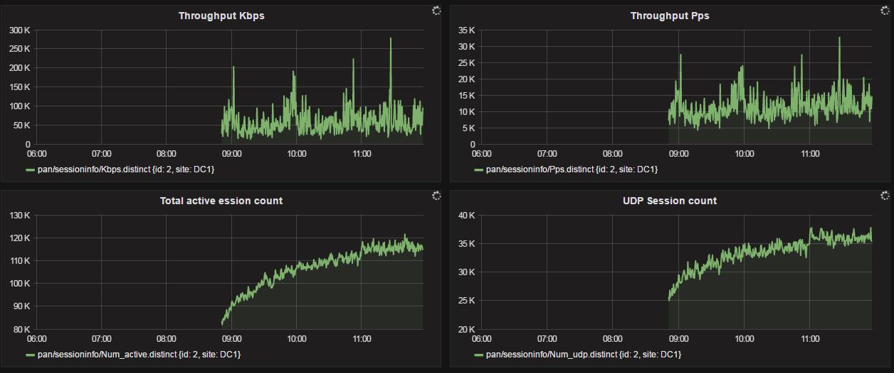

# snap collector plugin - sessioninfo
Collects Paloalto firewall session info  

It's used in the [snap framework](http://github.com:intelsdi-x/snap).

1. [Getting Started](#getting-started)
  * [System Requirements](#system-requirements)
  * [Operating systems](#operating-systems)
  * [Installation](#installation)
  * [Configuration and Usage](#configuration-and-usage)
2. [Documentation](#documentation)
  * [Collected Metrics](#collected-metrics)
  * [Examples](#examples)
3. [License](#license-and-authors)
4. [Acknowledgements](#acknowledgements)

## Getting Started
### System Requirements
* [golang 1.5+](https://golang.org/dl/)  - needed only for building. See also [How to install Go language](http://ask.xmodulo.com/install-go-language-linux.html)

### Operating systems
All OSs currently supported by snap:
* Linux/amd64

### Installation
#### To build the plugin binary:
```
$ go get -u github.com/IrekRomaniuk/snap-plugin-collector-sessioninfo
```
### Configuration and Usage
* Set up the [snap framework](https://github.com/intelsdi-x/snap/blob/master/README.md#getting-started).
* Load the plugin and create a task, see example in [Examples](https://github.com/IrekRomaniuk/snap-plugin-collector-sessioninfo/tree/master/examples).

## Documentation

### Collected Metrics

This plugin has the ability to gather the following metric:

Namespace | Description
----------|-----------------------
/pan/sessioninfo/num-active | session count.


### Example
Example running sessioninfo collector and writing data to an Influx database.

Load sessioninfo plugin
```
$ snaptel plugin load $GOPATH/bin/snap-plugin-collector-sessioninfo
```
List available plugins
```
$ snaptel plugin list
NAME                             VERSION         TYPE            SIGNED          STATUS          LOADED TIME
sessioninfo                      1               collector       false           loaded          Fri, 02 Dec 2016 15:00:51 EST
```
See available metrics for your system
```
$ snaptel metric list
```

Create a task manifest file and put firewall api key and IP address  (example files in [examples] (https://github.com/IrekRomaniuk/snap-plugin-collector-sessioninfo/blob/master/examples/task.yml)):
```yaml
version: 1
schedule:
  type: "simple"
  interval: "30s"
max-failures: 10
workflow:
  collect:
    metrics:
      /pan/sessioninfo/num-active: {}
    config:
      /pan/sessioninfo:
        api: ""
        ip: ""
        cmd: "&cmd=<show><session><info/></session></show>"
    publish:
      -
        plugin_name: "influxdb"
        config:
          host: "localhost"
          port: 8086
          database: "test"
          retention: "default"
          user: "admin"
          password: "admin"
          https: false
          skip-verify: false
```
Load InfluxDB plugin for publishing:
```
$ snaptel plugin load snap-plugin-publisher-influxdb
```

Create a task:
```
$ snaptel task create -t task.yml
Using task manifest to create task
Task created
ID: 031c21b1-475b-41a6-8053-675fff2c9b9d
Name: Task-031c21b1-475b-41a6-8053-675fff2c9b9d
State: Running
```

List running tasks:
```
$ snaptel task list
ID                                       NAME                                            STATE           HIT     MISS    FAIL    CREATED                 LAST FAILURE
031c21b1-475b-41a6-8053-675fff2c9b9d     Task-031c21b1-475b-41a6-8053-675fff2c9b9d       Running         0       0       0       3:01PM 12-02-2016
```
Watch the task
```
$snaptel task watch 031c21b1-475b-41a6-8053-675fff2c9b9d
Watching Task (031c21b1-475b-41a6-8053-675fff2c9b9d):
NAMESPACE                        DATA            TIMESTAMP
/pan/sessioninfo/num-active      105291          2016-12-02 15:26:46.915443395 -0500 EST
```
Watch metrics in real-time using [snap plugin for Grafana] (https://blog.raintank.io/using-grafana-with-intels-snap-for-ad-hoc-metric-exploration/) 
and use InfluxDB plugin for publishing 

## License
This plugin is Open Source software released under the Apache 2.0 [License](LICENSE).

## Acknowledgements
* Author: [@IrekRomaniuk](https://github.com/IrekRomaniuk/)

